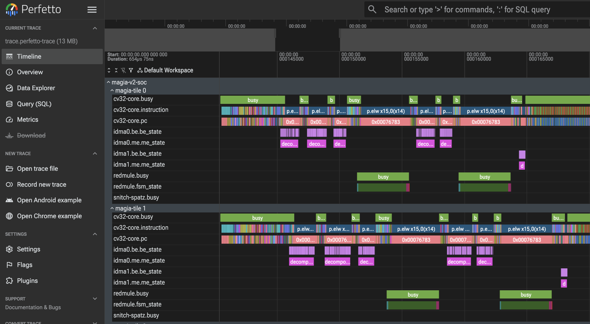

<p align="center">
  
</p>

# Magia-SDK
This repository contains the WIP development platform for the mesh-based architecture [MAGIA](https://github.com/pulp-platform/MAGIA/tree/main).
It provides useful tools for programming and running software applications on simulated MAGIA architectures for benchmarking, debugging and profiling.

Magia and Magia-SDK are developed by the University of Bologna and Chips-IT as part of the [PULP project](https://pulp-platform.org/index.html).

## Prerequisites

The following steps assume the default target platform, `magia_v2`, on which Spatz support is enabled by default (`spatz=1`).

0. Python environment: we recommend using either `uv` or `pyenv + venv` to create a working environment.

    With `uv`, simply run

    `make gvsoc_uv`

    With `pyenv`, you can build a new environment by first installing pyenv by running the following command. FOLLOW THE INSTRUCTIONS GIVEN BY THE TERMINAL TO THE LETTER (including updating the PATH environment variable)

    `curl https://pyenv.run | bash`

    After you have done that, you can install a python environment with all the necessary requirements by running:

    `pyenv install 3.12`

    `make gvsoc_venv`

    In both cases, to activate the generated environment, run:

    `source ./gvsoc_venv/bin/activate`

    From the SDK's root directory. If you have done it correctly, you'll see a "(gvsoc_venv)" preceding your terminal command line.

1. RISC-V GCC toolchain: make sure it is installed and visible in the `$PATH` environment variable. You can check if and where the compiler is installed by running the following command on your root (`/`) directory:

    `find . ! -readable -prune -o -name "riscv32-unknown-elf-gcc" -print`

    It is possible to also use the PULP_MULTILIB toolchain from openhwgroup, which has a different name. However, do keep in mind its full operationality has **NOT** been tested:

    `find . ! -readable -prune -o -name "riscv64-unknown-elf-gcc" -print`

    Then add the compiler to the `$PATH` environment variable with:

    `export PATH=<absolute path to directory containing the compiler binary>:$PATH`

    In case you don't have a toolchain, or the toolchain in your machine has compiler errors (such as requiring strange strange ISA extensions), you can build your own toolchain by following the steps listed [HERE](https://github.com/pulp-platform/pulp-riscv-gnu-toolchain).

    In case you want to use a different toolchain, or want to specify a particular toolchain installed in your filesystem, you can edit the file *magia-sdk/cmake/toolchain_gcc_multilib.cmake* to point to your desired toolchain binary file. Make sure the ILP and API extensions in *CMakeLists.txt* are supported by the toolchain.

2. Spatz LLVM toolchain: since Spatz support is enabled by default, the compilation flow requires a dedicated Spatz LLVM toolchain.
   You can install it automatically by running the following command from the SDK root:

    ```sh
    make llvm
    ```

    This will clone the required repository and build the toolchain in the `llvm/install` directory. Alternatively, if you have a pre-built toolchain, you can specify its location by passing the `LLVM_INSTALL_DIR` variable to the make command:

    ```sh
    make build LLVM_INSTALL_DIR=/path/to/your/llvm/install
    ```

3. (Optional, RTL only) In case you are using this SDK as non-submodule, and you want to simulate the RTL: Clone the [MAGIA](https://github.com/pulp-platform/MAGIA/tree/main) repository:

    `git clone git@github.com:pulp-platform/MAGIA.git`

    Then modify the magia-sdk **Makefile** to point to the correct paths:

        MAGIA_RTL_DIR ?= path/to/MAGIA/repository

        BUILD_DIR ?= $(MAGIA_RTL_DIR)//work/sw/tests/$(test).c

    It is also required to have a `cmake` version >= 3.13.

    In case you are NOT interested in the RTL and only want to simulate the architecture on GVSoC, you can ignore the previous command.

## Getting started and Usage

The following *optional* parameters can be specified when running the make command:

`target_platform`: **magia_v1**|**magia_v2** (**Default**: magia_v2). Selects the target platform to build and run tests on. Magia V1 is the legacy mode using the CV32E40X core, whereas magia_v2 is the new platform using CV32E40P. No future support for magia_v1 is planned.

`build_mode`: **update**|**profile**|**synth** (**Default**: profile). Selects the mode that the MAGIA architecture is built.

`fsync_mode`: **stall**|**interrupt** (**Default** stall). Selects the Fractal Sync module synchronization behaviour.

`compiler`: **GCC_MULTILIB**|**GCC_PULP**|**LLVM** (**Default**: GCC_PULP). Selects the compiler to be used. LLVM is currently WIP. PULP is the risc-v 32 bits only toolchain NOT supporting floating point instructions, wheras the MULTILIB toolchain is the nightly risc-v one.

`ISA`: **rv32imcxgap9**|**rv32imafc** (**Default**: rv32imcxgap9) ISA target for the GCC toolcahin.

`platform`: **rtl**|**gvsoc**. Selects the simulation platform. GVSoC is currently WIP, some tests may fail.

`tiles`: **2**|**4**|**8**|**16** (**Default**: 2). Selects number of rows and columns for the mesh architecture.

`test_name`: Name of the test binary to be run.

`eval`: **0**|**1** (**Default**: 0). Activates printing of error values in the testsuite.

`gui`: **0**|**1** (**Default**: 0). Activates the graphic user interface on the simulator (rtl only).

`fast_sim`: **0**|**1** (**Default**: 0). Deactivates signal tracking for faster simulation (rtl only).

`redmule|fsync|idma_mm`: **0**|**1** (**Default**: 1). Uses memory mapped instructions for redmule|fsync|idma. **NOT SUPPORTED IN MAGIA_V1**

`stalling`: **0**|**1** (**Default**: 0). Activates stalling mode on tiles instead of using the event unit. **STALLING MUST BE SET ON 1 FOR MAGIA_V1**

`profile_cmp|cmi|cmo|snc`: **0**|**1** (**Default**: 0). Activates the profiling utilities for computing|comunication(input line)|comunication(output line)|synchronization

`spatz`: **0**|**1** (**Default**: 1). Enable compilation of GVSoC and tests with Spatz enabled

`verbose`: **0**|**1** (**Default**: 0). When 1, `make build` restores the full CMake configure trace and per-file compiler command lines. Leave at 0 for concise progress output.

`test`: When set on `make build` (e.g. `make build test=<test_name>`), builds only that single test target instead of the whole test suite. The name is the same test binary name used by `make run test=...`.

Once the [Prerequisites](#prerequisites) are in place:

1. Initialize the GVSoC submodule:

    `make gvsoc_init`

2. Build the Magia RTL architecture (*this command may take time and return an error, please be patient.*):

    `make MAGIA <target_platform> <tiles> <build_mode> <fsync_mode>`

    and/or the GVSoC module:

    `make gvsoc <tiles>`

    You can clean the MAGIA rtl and all the tests+logs by running:

    `make rtl-clean`

3. To compile and build the test binaries for a desired architecture run:

    `make clean build <target_platform> <tiles> <compiler> <eval>`

    To build a single test instead of the whole suite, pass `test=<test_name>`; add `verbose=1` for full compiler/CMake output:

    `make build test=<test_name>` (or `make build verbose=1`)

    To run one of the tests:

    `make run test=<test_name> <platform>`

***WARNING: YOU HAVE TO REBUILD BOTH RTL/GVSOC AND THE TEST BINARY EACH TIME YOU WANT TO TEST A MAGIA MESH WITH A DIFFERENT NUMBER OF TILES.***

If you want to run gvsoc or a binary from outside the magia-sdk directory you can edit the **GVSOC_ABS_PATH** and **BIN_ABS_PATH** option in Makefile or directly on the *run* command line.

GVSOC will use **GVSOC_WORK_DIR** as working directory (default: `./gvsoc_work`). You will find traces, outputs, etc. there.

To ensure a clean re-build of the RTL, you can run:

`make rtl-clean`

before building the RTL back using the `make MAGIA` command.

## Adding your own test

This SDK uses a nested CMakeList mechanism to build and check for dependencies.
To add your own test, you have to integrate a new test folder inside the **tests** directory.

1. Change directory to the desired architecture test folder

    `cd tests/<target_platform>/mesh`

2. Create a new test directory

    `mkdir <test_name>`

3. Modify the *CMakeList.txt* file in the current mesh directory, adding the following line:

    `add_subdirectory(<test_name>)`

    You can also *exclude* the generation of other tests binaries by commenting/deleting the lines for those tests.

4. Add to the *\<test_name\>* directory:

    1. A new CMakeList.txt file following this template:

            set(TEST_NAME <test_name>)

            file(GLOB_RECURSE TEST_SRCS
            "src/*.c"
            )

            add_executable(${TEST_NAME} ${TEST_SRCS})
            target_include_directories(${TEST_NAME} PUBLIC include)

            target_compile_options(${TEST_NAME}
            PRIVATE
            -O2
            )
            target_link_libraries(${TEST_NAME} PUBLIC runtime hal)

            add_custom_command(
                    TARGET ${TEST_NAME}
                    POST_BUILD
                    COMMAND ${CMAKE_OBJDUMP} -dhS -Mmarch=${ISA} $<TARGET_FILE:${TEST_NAME}> > $<TARGET_FILE:${TEST_NAME}>.s)

    2. An **src** directory containing your test's source (.c) files

    3. An **include** directory containing your test's header (.h) files


## Profiling

If you wish to profile your code in terms of cycles, it is possible to do it on both GVSoC and RTL.

However, be aware that the utilities are different based on the simulation platform you want to use.

In case you are simulating on GVSoC, please use the `perf_get_cycles()` utility:

    int start = perf_get_cycles();

    // CODE YOU WANT TO PROFILE //

    int end = perf_get_cycles();

    printf("Cycles: %d\n", (int) (end - start));

In case you are working on RTL, please use the sentinel utilities:

    sentinel_start();

    // CODE YOU WANT TO PROFILE //

    sentinel_end();

### GVSoC Perfetto Profiling

The GVSOC model of MAGIA can be profiled by means of VCD tracing that, for ease of visualization, are converted to the Perfetto protobuf format.
To generate a trace dump for post-simulation analysis, use the `run_profiling` target instead of `run`:

`make run_profiling test=<test_name> tiles=<N>`

This is equivalent to `make run platform=gvsoc` but adds `--vcd --event=.*` to the GVSoC invocation, capturing all signal events.

To restrict the trace to a specific tile, pass `profile_tile=<tile_id>`:

`make run_profiling test=<test_name> tiles=<N> profile_tile=<tile_id>`

This appends `--trace=tile-<tile_id>-idma-ctrl-mm` to the GVSoC command. For example, to profile tile 12:

`make run_profiling test=my_test tiles=4 profile_tile=12`

If `profile_tile` is not specified, no tile-specific trace filter is applied.
The traces will be available in `$(GVSOC_WORK_DIR)/trace.perfetto-trace` (default: `gvsoc_work/trace.perfetto-trace`) and can be visualized with [Perfetto](https://ui.perfetto.dev/) (also available as [Perfetto Trace VSCode extension](https://marketplace.visualstudio.com/items?itemName=drain99.perfetto-trace)).

To additionally dump the cv32 cores' instruction execution trace, pass `gvsoc_trace=1` (default: `0`):

`make run_profiling test=<test_name> tiles=<N> gvsoc_trace=1`

This enables GVSoC instruction traces for the cv32 cores by appending one `--trace='tile-<id>-cv32-core:...'` per tile to the GVSoC command, writing **one trace file per tile** to `$(GVSOC_WORK_DIR)/cv32_trace_tile<id>.log` (default: `gvsoc_work/cv32_trace_tile<id>.log`).



## Continuous Integration

CI runs via GitHub Actions (`.github/workflows/github-ci.yml`). It does **not** execute tests locally — instead it mirrors the branch to a GitLab instance at `iis-git.ee.ethz.ch/github-mirror/magia-sdk-mirror` and waits for that pipeline to complete. A `GITLAB_TOKEN` secret with `read_api` scope must be configured on the GitHub repository. CI is automatically skipped for forks.

### Reading CI failure logs

When the GitLab pipeline fails, the workflow automatically:

1. Fetches the trace (console log) for every failed GitLab job via `scripts/ci/fetch_gitlab_logs.sh`.
2. Saves each trace as `gitlab-logs/<stage>__<job>.trace`.
3. Prints the **last 200 lines** of each trace in the **"🔶 Show error log"** GitHub Actions step (visible in the collapsible group labelled `FAILED: <job_name>`).

To read the full logs, download the `gitlab-logs` artifact from the failed GitHub Actions run — it contains the complete `.trace` files for all failed jobs, plus any job artifacts (e.g. build outputs) if the GitLab job uploaded them.

## Code Style

The repository ships a `.clang-format` file (LLVM-based, 100-column limit). Formatting is enforced in CI on the C/C++ files changed in your branch (vs. `main`); see [Format CI](#format-ci) below.

### `make format`

Run from the repo root to apply `.clang-format` to all C/C++ files (`*.c *.h *.cpp *.hpp *.cc *.hh`) changed on the current branch relative to its merge-base with `main`. This includes both committed changes and any local staged/unstaged edits, so it is safe to run while work is in progress:

```bash
make format
```

Files outside the branch's diff are never touched, avoiding noisy reformats of pre-existing code. The selection logic lives in `scripts/ci/format-changed.sh` and is shared with CI.

### Format CI

The `Format Check` GitHub Actions workflow (`.github/workflows/format-ci.yml`) runs on every push and pull request. It invokes `scripts/ci/format-changed.sh check --committed`, which runs `clang-format --dry-run --Werror` on the same set of changed files. The job fails if any of those files are not properly formatted — run `make format` locally and commit the result to fix it.

### VS Code setup

1. Install the [C/C++ extension](https://marketplace.visualstudio.com/items?itemName=ms-vscode.cpptools) (by Microsoft).
2. Add the following to `.vscode/settings.json`:

```json
{
  "editor.formatOnSave": true,
  "C_Cpp.clang_format_style": "file",
  "C_Cpp.clang_format_fallbackStyle": "LLVM"
}
```

`"file"` instructs the extension to locate `.clang-format` by walking up from the file being edited, picking up the one at the repo root. With `formatOnSave` enabled, every C/C++ file is formatted automatically on save. You can also trigger formatting manually with `Shift+Alt+F`.

## GVSOC Regression Test

It is possible to test the correctness of the repository by running the extensive regression test on the GVSoC simulator.

To do so, you need pyenv (see [Prerequisites](#prerequisites)), with Python 3.12 installed:

    pyenv install 3.12

After doing that, you can run the entire testsuite on all the available mesh architectures (from 1x1 to 16x16) with:

    source scripts/regression_gvsoc.sh

**Must be run from the root directory of magia-sdk**.

The test outputs are stored in the *scripts/regression_output_* folders.

## Spatz integration in MAGIA

This SDK provides a flow to compile C code for the Spatz vector accelerator, embed the resulting binary into the main CV32 executable, and manage the execution. This allows the main RISC-V core (CV32) to offload tasks to the Spatz accelerator.

Examples using this flow are available in the `tests/spatz_on_magia/` directory. Each test sub-folder contains a `main.c` for the CV32 host and a `spatz_task/` directory with the source code for the Spatz accelerator.

For more informations about hardware integration, configuration parameters, control interface, programming APIs and execution flow please refer to the [MAGIA-Spatz README](https://github.com/pulp-platform/MAGIA/tree/lb/magia-spatz/spatz)

> **Warning:** The external README linked above is tailored for baremetal hardware development. Some information may overlap or contain minor inaccuracies regarding the specific abstractions and automation provided by this SDK.

See the [Prerequisites](#prerequisites) section for setting up the required Spatz LLVM toolchain, and [Spatz CMake Integration Details](#spatz-cmake-integration-details) below for how the compilation flow is implemented and how to use it in your own `CMakeLists.txt`.

## Folder Structure

### README.md
This file.

### Makefile
Makefile script to run the sdk.

### CMakeLists.txt
Root CMakeLists file to compile and build the executable test/application binaries for one of the available architectures.

### targets
This directory contains the *startup routine*, *linker script*, *address map*, *register definitions*, *custom ISA instructions*, *MAGIA mesh and tile util instructions* for each available architecture.

### scripts
Contains scripts to automatize the test building and running.

### hal
Contains the weak definitions of this SDK APIs. These are the API instruction that should be used by the programmer when developing applications to be run on MAGIA. These instructions are then overloaded by the corresponding driver implementation specific for the chosen architecture. The APIs currently available are for controlling and using the *idma*, *redmule* and *fractalsync* modules.

### drivers
Contains the architecture-specific implementation and source code for the HAL APIs. Despite each implementation having different names, thanks to an aliasing system the programmer can use the same name for the same API instruction on different architectures.

### devices
Nothing there.

If MAGIA ever evolves to have a host-offload mechanism, this folder will contain the trampoline functions.

### cmake
Contains utility files for *cmake* automatic compilation.

### gvsoc
A submodule containing the Germain Virtual System on Chip, built to simulate MAGIA (and other PULP-related platforms).

## Spatz CMake Integration Details

The compilation process for the Spatz flow described above is managed by two CMake functions defined in `cmake/spatz_helpers.cmake`: `add_spatz_task` and `add_cv32_executable_with_spatz`.

### 1. `add_spatz_task`
This function compiles the C code for the Spatz accelerator and prepares it for embedding.

*   **What it does**:
    1.  Compiles the Spatz source code into an ELF binary using a dedicated `clang` compiler from the Spatz LLVM toolchain.
    2.  Converts the ELF file into a raw binary format (`.bin`).
    3.  Uses the `scripts/bin2header.py` script to transform the raw binary into a C header file. This header contains a `uint32_t` array holding the machine code of the Spatz task. This array is placed in a special linker section named `.spatz_binary`.
    4.  Runs the `scripts/extract_task_symbols.sh` script to append additional information to the header. This script inspects the Spatz ELF file and extracts the addresses of key symbols, defining them as macros. These symbols include:
        *   `SPATZ_BINARY_START`: The starting memory address where the Spatz binary will be loaded. This is resolved by the CV32 linker.
        *   `SPATZ_DISPATCHER_LOOP`: The entry point for the Spatz control loop.
        *   Task function addresses (e.g., `MY_TASK`): Entry points for specific functions within the Spatz code that can be called from the CV32 host.

### 2. `add_cv32_executable_with_spatz`
This function compiles the main application for the CV32 core and embeds the Spatz binary within it.

*   **What it does**:
    1.  Compiles the C source code for the CV32 processor.
    2.  Includes the header file generated by `add_spatz_task`. By including this header, the Spatz binary (as a C array) becomes part of the CV32 application's source.
    3.  Links the compiled CV32 code with the Spatz binary data. The main linker script (`targets/magia_v2/link.ld`) ensures that the `.spatz_binary` section is placed at the correct memory address.

### Example Usage
To use this flow, you need to call the two functions in your `CMakeLists.txt`. The convention is to have separate sources for the host (CV32) and the accelerator (Spatz).

Here is an example from `tests/spatz_on_magia/hello_spatz/CMakeLists.txt`:
```cmake
set(TEST_NAME hello_spatz)

# Step 1: Compile the Spatz task and generate the C header
add_spatz_task(
    TEST_NAME ${TEST_NAME}
    TASK_SOURCES ${CMAKE_CURRENT_SOURCE_DIR}/spatz_task/hello_task.c
    FIRST_TASK_NAME hello_task
)

# Step 2: Compile the CV32 executable and embed the Spatz binary
add_cv32_executable_with_spatz(
    TARGET_NAME ${TEST_NAME}
    SPATZ_HEADER ${SPATZ_HEADER}
    SOURCES ${CMAKE_CURRENT_SOURCE_DIR}/main.c
)
```

### Run Tests
To run test a special Makefile rule can be used: `make run test=<test_name> platform=<rtl|gvsoc>`.
